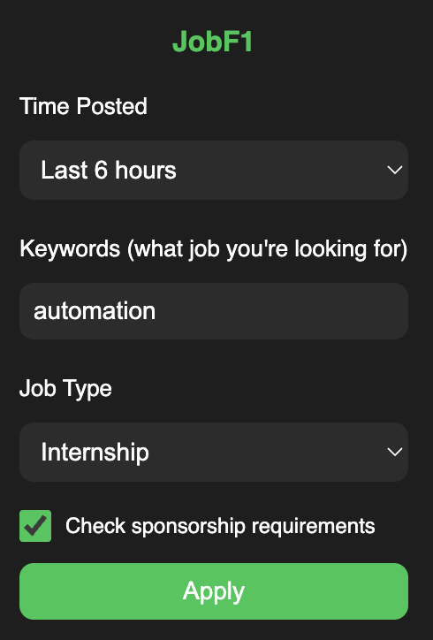

# JobF1 - Visa-Friendly Job Finder

A Chrome extension that enhances LinkedIn job searching for international students and visa holders. Automatically filters jobs by time, keywords, and job type while detecting visa sponsorship requirements.

## Features

- **Visa Sponsorship Detection**: Automatically analyzes job descriptions for visa restrictions
- **Real-time Analysis**: Instant notifications about sponsorship requirements
- **Time Filters**: Filter jobs by posting time (5 min to 1 month, or any time)
- **Smart Keywords**: Search with Boolean operators for precise job matching
- **Job Type Filtering**: Filter by internships, full-time, or all positions

## Installation

### Manual Installation (Developer Mode)

1. **Download the Extension**

   - Clone or download this repository
   - Extract files if downloaded as ZIP

2. **Enable Developer Mode**

   - Open Chrome and go to `chrome://extensions/`
   - Toggle "Developer mode" in the top-right corner

3. **Load the Extension**

   - Click "Load unpacked"
   - Select the JobF1 folder containing the extension files
   - The extension should appear in your extensions list

4. **Pin the Extension** (Recommended)
   - Click the puzzle piece icon in Chrome's toolbar
   - Pin JobF1 for easy access

## Usage

### Basic Setup

1. Click the JobF1 extension icon
2. Configure your preferences:

   - **Time Posted**: Choose how recent jobs should be
   - **Keywords**: Enter job titles/skills (comma-separated)
   - **Job Type**: Select internship, full-time, or all
   - **Check sponsorship requirements**: Enable visa analysis

3. Click "Apply" to activate filters

### Features in Detail

#### Time Filtering

- Select from 5 minutes to 1 month
- Choose "Any time" to disable time filtering
- Automatically applied to LinkedIn searches

#### Keyword Search

- Use comma-separated keywords: `software engineer, data scientist`
- Automatically adds Boolean operators for precise matching
- Combines with job type filters intelligently

#### Visa Sponsorship Analysis

- **Enable**: Check "Check sponsorship requirements"
- **Automatic Detection**: Analyzes job descriptions for:
  - ITAR/Export control requirements
  - US citizenship requirements
  - Security clearance needs
  - Direct "no sponsorship" statements
  - Student visa restrictions

#### Visual Indicators

- **🚨 Red notification**: Visa restrictions found
- **✅ Green notification**: Visa-friendly or no restrictions detected
- **Detailed reasons**: Shows specific text that triggered the analysis

### Tips

- Enable visa checking only when needed to save performance
- Use specific keywords for better job matching
- Combine filters for targeted job searches
- Notifications auto-dismiss after 8-12 seconds

## Technical Details

- **Manifest Version**: 3
- **Permissions**: tabs, storage, webNavigation, activeTab
- **Host Permissions**: LinkedIn.com only
- **Content Script**: Analyzes job pages in real-time
- **Background Service**: Handles navigation and URL filtering

## Compatibility

- **Chrome**: Version 88+
- **Platform**: LinkedIn Jobs only
- **Languages**: JavaScript (ES6+)

## Privacy

- **Data Storage**: Preferences stored locally in Chrome
- **No External Servers**: All processing done locally
- **No Data Collection**: Extension doesn't collect personal information
- **LinkedIn Only**: Works exclusively on LinkedIn job pages

## Contributing

Feel free to submit issues or pull requests to improve the extension.

## License

This project is open source. Please respect LinkedIn's terms of service when using this extension.
