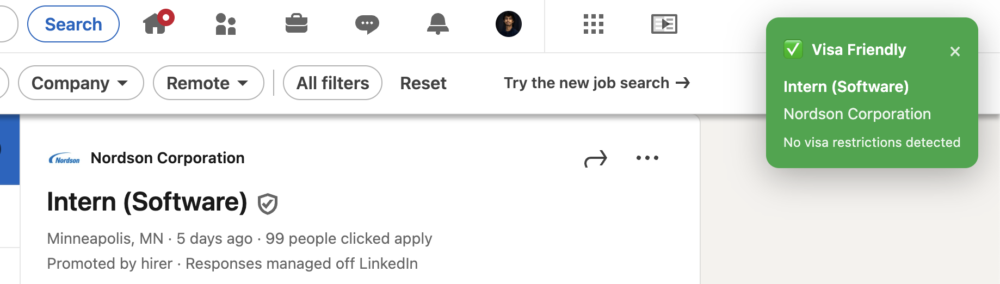
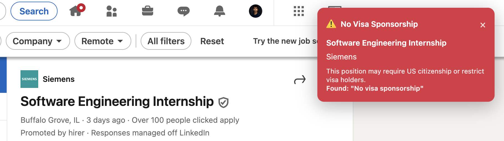

# JobF1 - Visa-Friendly Job Finder

As international students, we often struggled with LinkedIn job searches. You’d spend hours scrolling, only to realize the posting required US citizenship or didn’t sponsor visas. JobF1 fixes that.

It’s a Chrome extension that filters LinkedIn jobs by time, keywords, and type—while automatically flagging sponsorship restrictions. No more wasted time applying to jobs you’re not eligible for.

---

## What It Does

* Detects visa restrictions in job descriptions (citizenship, ITAR, no sponsorship, etc.)
* Filters jobs by posting time (5 minutes to 1 month)
* Smart keyword search with Boolean support
* Job type filtering: internships, full-time, or all
* Clear green/red indicators with reasons for sponsorship status

---

## Example

Searching for **Software Engineer Intern**:

* Job A → Requires US Citizenship
* Job B → Visa-friendly
* Job C → States "No sponsorship available"

Result: you instantly know which jobs are worth your time.

---

## Visual Indicators

* Green notification = Visa-friendly or unrestricted job
  

* Red notification = Job with visa restrictions (citizenship, no sponsorship, ITAR, etc.)
  

---

## Install

### Manual Setup (Developer Mode)

1. Clone or download this repo
2. Go to `chrome://extensions/` in Chrome
3. Enable Developer Mode (top-right)
4. Click **Load unpacked** and select the JobF1 folder
5. Pin the extension for easy access

---

## Usage

1. Click the JobF1 icon in Chrome
2. Set filters:

   * Time posted
   * Keywords
   * Job type
   * Visa sponsorship check
3. Apply filters → LinkedIn updates instantly

---

## Tech

* Chrome Extension (Manifest V3)
* JavaScript (ES6+)
* Runs fully local, no data collection

---

## Notes

* Works only on LinkedIn job pages
* Data stays on your machine—no external servers
* Use responsibly within LinkedIn’s terms of service

---

## License

MIT License
